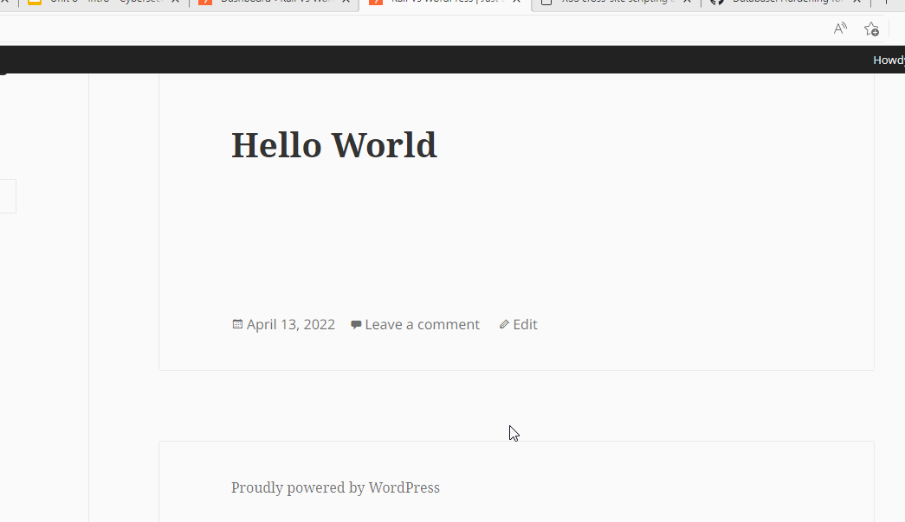

# Pen Testing Report On Wordpress
Testing certain penetration methods on WordPress 4.1

## Intial Scan
1.  The first step in my initial scan was to have the docker images of both wordpress and kali running. With kali invoked we will first update the WordPress scans database using 
wpscan --update

2.	Now, I ran wpscan against the running WordPress instance on my local host. Using the following command 
wpscan --url http://127.0.0.1:8080 --api-token YOUR_API_TOKEN
Once scan was run 92 vulnerabilities were found 
 

## Vulenabilities 
### 1. WordPress <= 5.0 - Authenticated Cross-Site Scripting (XSS)
 Fixed in: 4.1.25
References:
- https://wpscan.com/vulnerability/3182002e-d831-4412-a27d-a5e39bb44314
- https://cve.mitre.org/cgi-bin/cvename.cgi?name=CVE-2018-20153
- https://wordpress.org/news/2018/12/wordpress-5-0-1-security-release/

 
 
 Steps to recreate:
 
 1.Login as admin
 
 2.Create a post as authenticated user.
 
 3. Paste script>alert(xss)</script>
 
 ### 2. WordPress 2.8-4.7 - Accessibility Mode Cross-Site Request Forgery (CSRF)
Fixed in: 4.1.14
References:
 - https://wpscan.com/vulnerability/e080c934-6a98-4726-8e7a-43a718d05e79
 - https://cve.mitre.org/cgi-bin/cvename.cgi?name=CVE-2017-5492
 - https://github.com/WordPress/WordPress/commit/03e5c0314aeffe6b27f4b98fef842bf0fb00c733
- https://wordpress.org/news/2017/01/wordpress-4-7-1-security-and-maintenance-release/

 Steps to recreate:
 1.Login as admin
 2.Create a post as authenticated user.
 3. 

 
 ### 3. WordPress  4.0-4.7.2 - Authenticated Stored Cross-Site Scripting (XSS) in YouTube URL Embeds
Fixed in: 4.1.16
References:
- https://wpscan.com/vulnerability/3ee54fc3-f4b4-4c35-8285-9d6719acecf0
- https://cve.mitre.org/cgi-bin/cvename.cgi?name=CVE-2017-6817
- https://wordpress.org/news/2017/03/wordpress-4-7-3-security-and-maintenance-release/
 - https://github.com/WordPress/WordPress/commit/419c8d97ce8df7d5004ee0b566bc5e095f0a6ca8
 - https://blog.sucuri.net/2017/03/stored-xss-in-wordpress-core.html
 
  Steps to recreate:
  
 1.Login as admin
 
 2.Create a post as authenticated user.
 
 3. Change from visual tab to text tab 

4. Paste [embed src='https://www.youtube.com/embed/1235689\x3csvg onload=alert(1)\x3e'][/embed]
 

 
### 4. Username and password enumeration using metasploit 
 

Steps to recreate 

1. start up metsplsoit 

2. Find correct payload, use following commands
   -search type:auxiliary wordpress xmlrpc
   -use auxiliary/scanner/http/wordpress_xmlrpc_login 
  
3. Set target and conditions for payload
   - setg RHOSTS 127.0.0.1
   - set RPORT 8080
   - set traget uri /
   - set STOP_ON_SUCESS
   - set username/password or useneme/password  files (ex. set PASS_FILE password.txt)
   - set Httptrace TRUE
   - run
 
 If your files contain the correct username and password once matched the payload will stop running. 

   

