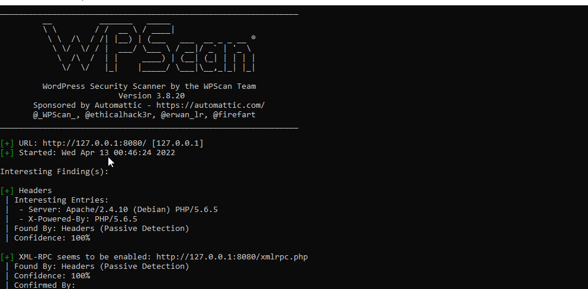

# Pen Testing Report On Wordpress
Testing certain penetration methods on WordPress

## Intial Scan
1.  The first step in my initial scan was to have the docker images of both wordpress and kali running. With kali invoked we will first update the WordPress scans database using 
wpscan --update

2.	Now, I ran wpscan against the running WordPress instance on my local host. Using the following command 
wpscan --url http://127.0.0.1:8080 --api-token YOUR_API_TOKEN
Once scan was run 92 vulnerabilities were found 
 

## Vulenabilities 
### 1. WordPress <= 5.0 - Authenticated Cross-Site Scripting (XSS)
 Fixed in: 4.1.25
References:
- https://wpscan.com/vulnerability/3182002e-d831-4412-a27d-a5e39bb44314
- https://cve.mitre.org/cgi-bin/cvename.cgi?name=CVE-2018-20153
- https://wordpress.org/news/2018/12/wordpress-5-0-1-security-release/
- 
 
